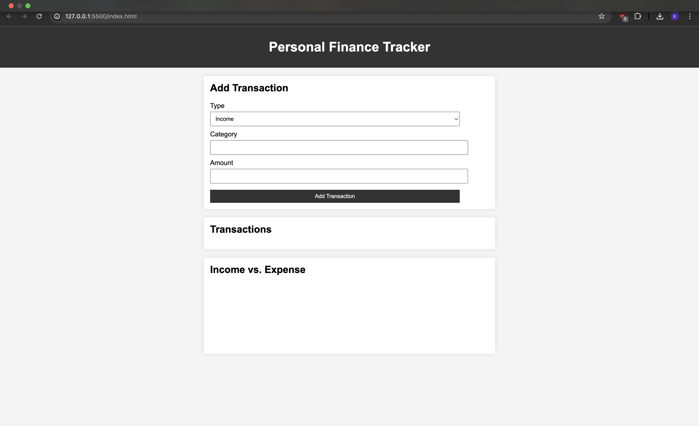
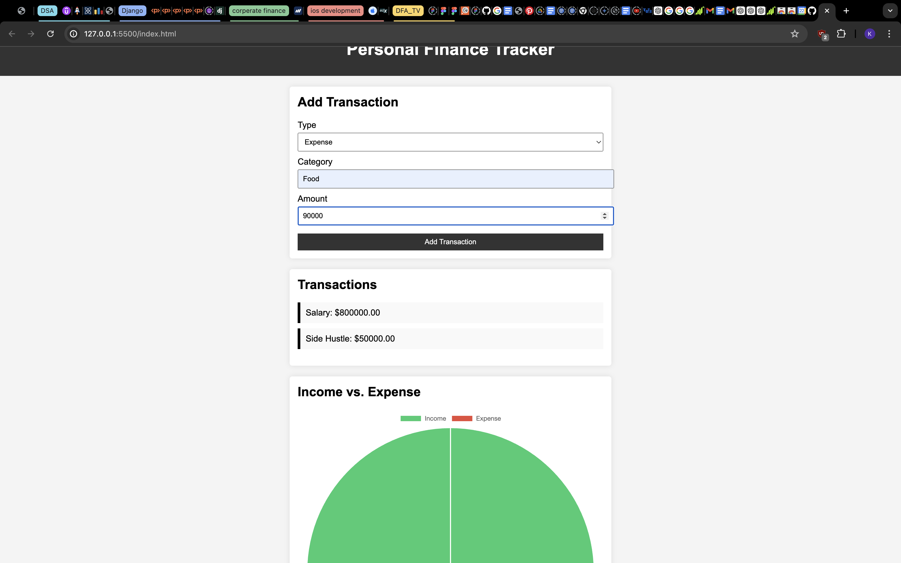
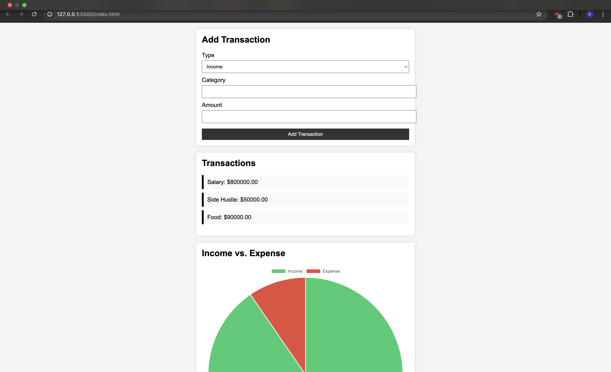
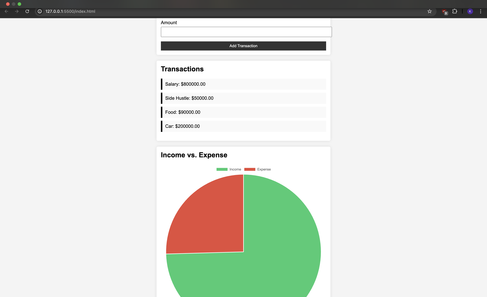

# Personal Finance Tracker

This is a simple personal finance tracker that allows users to record and categorize their income and expenses. The application stores data in the browser's local storage and displays income vs. expense data using a pie chart.

## Features

- Input forms for recording income and expenses.
- Categorization of transactions into income and expenses.
- Data persistence using browser storage.
- Responsive design for usability on various devices.
- Visual representation of income vs. expense data using a pie chart.
.

Below are the visualization
This is the home page

Inputting Income

Inputting Expenses (i.e Amount spent)

Overall Visualization to show my total Income is more than my Expense

